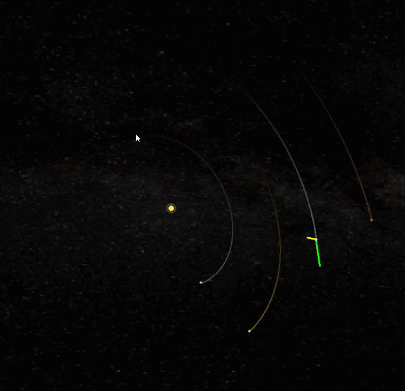
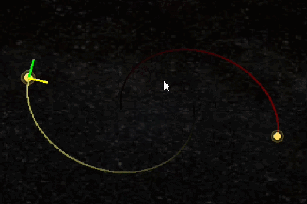

# Orbital Mechanics Simulator

An interactive 3D N-body orbital mechanics simulator built from scratch in Python using Pygame.

## Features
- Newtonian N-body gravitational simulation
- Velocity Verlet and Euler integration
- Interactive 3D camera and perspective projection
- Forward simulation and time reversal
- Custom body creation with position and velocity placement
- Custom mass, name, colors, and orbital-plane alignment
- Body, center-of-mass, and origin camera targeting
- Velocity and acceleration vector visualization
- Orbital trails and body diagnostics
- Energy tracking
- Multiple preset systems, including the Solar System and a binary star system




- ## Controls

- **A / D** — Pan camera
- **W / S** — Pitch camera
- **E / Q** — Zoom in / out
- **J** — Reset camera zoom
- **B** — Place a custom body
- **T** — Select body / camera target
- **V** — Toggle velocity and acceleration vectors
- **P** — Pause simulation
- **Arrow Keys** — Simulate forward / rewind while paused
- **9** — Switch between Velocity Verlet and Euler integration
- **C** — Toggle cinematic mode
- **M** — Toggle simulation statistics
- **1** — Earth–Moon–Sun preset
- **2** — Inner Solar System preset
- **3** — Solar System preset
- **4** — Binary star preset
- **5** — Empty system

##  Running the Simulator - Requirements
- Python 3
- Pygame

Install Pygame:
```bash
pip install pygame
```

Then run:
```bash
python motion.py
```

## How It Works
The simulator models gravitational interactions between every body using Newton's law of universal gravitation. 
Positions and velocities are evolved numerically using either the Velocity Verlet or Euler integration method.

The simulation uses astronomical units (AU), years, and solar masses, giving the gravitational constant:

`G = 4π²`

The 3D renderer is also implemented directly in the project.
World-space coordinates are transformed relative to an orbiting camera and projected onto the 2D screen using perspective projection.



Users can create new bodies interactively by selecting a position, assigning a velocity vector,
and configuring properties such as mass, name, color, distance from the primary body, and orbital-plane alignment.

### Full Demonstration

[▶ Watch the full Orbital Mechanics Simulator demonstration](https://youtu.be/Ilg3BMBFPUw)

## About
This project began as an exploration of orbital mechanics and grew into a general-purpose interactive physics sandbox.
It was built to explore N-body gravity, numerical integration, orbital motion, and 3D visualization through direct experimentation.

The simulator was developed in Python with Pygame.
